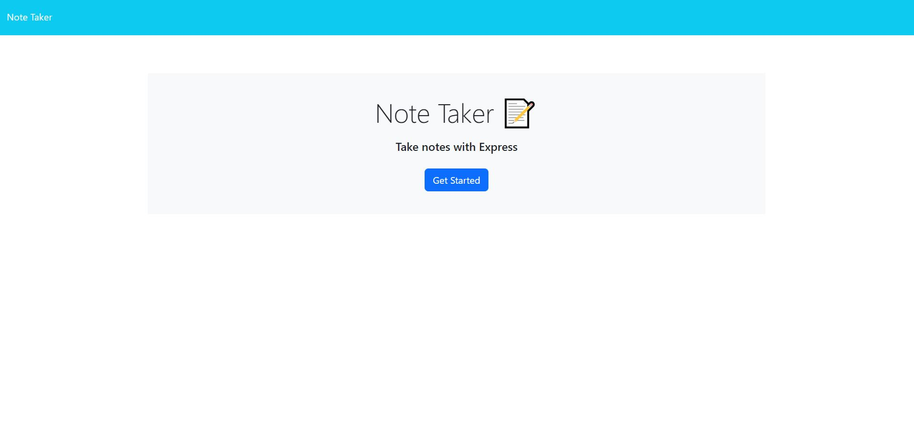
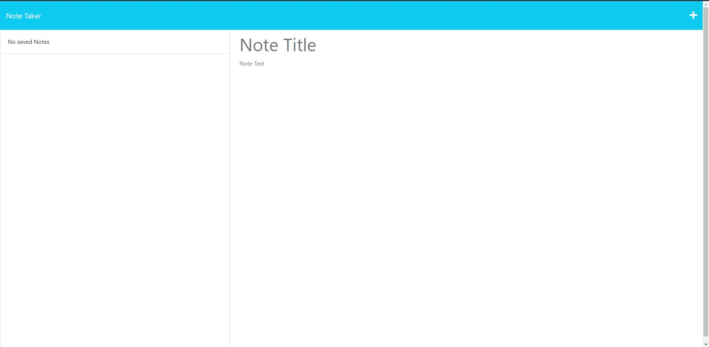
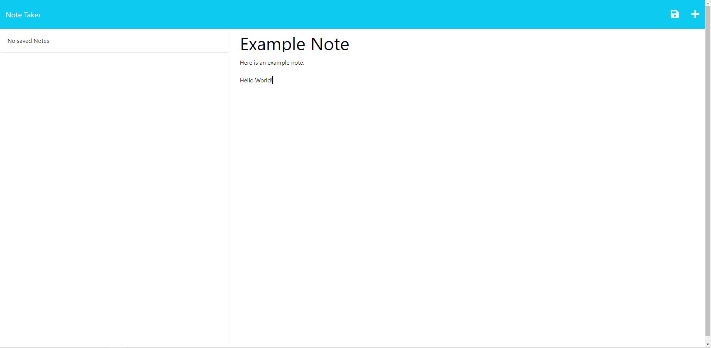
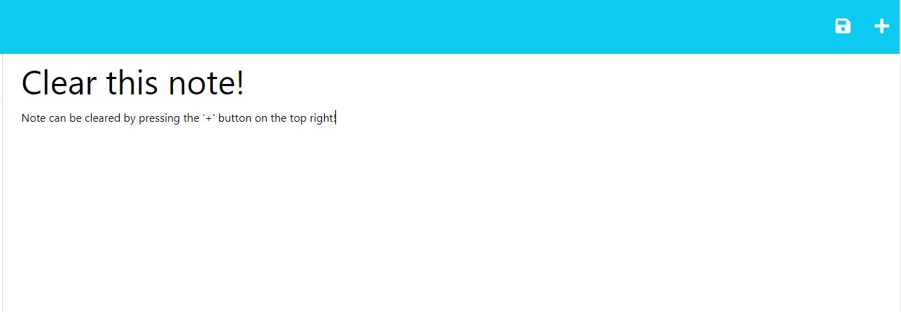
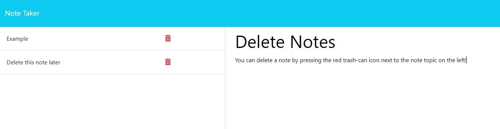
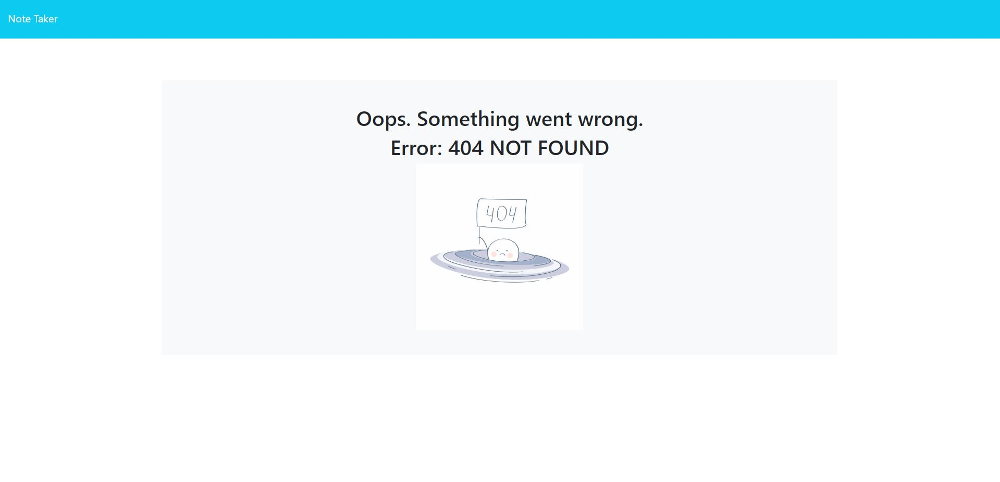

# [Note-Taker (UCSD Challenge #11)](https://note-taker-challenge-11-ucsd-53f90d47f2b1.herokuapp.com/)

## Description

- A simple to use note-taking application that saves and deletes user-made notes in a sleek, pleasing interface.
- Built using JavaScript, with NodeJS as the Server Environment and Express.js as the Web Framework.
- Working with a web framework to fetch data from a set database has furthered my knowledge in building scalable, interactive, and responsive Web Applications.

## Installation

[**Live deployment from Heroku- Access by clicking here.**](https://note-taker-challenge-11-ucsd-53f90d47f2b1.herokuapp.com/)

**Self-Host/Local Deployment**

- For self-testing purposes, you may want to deploy the application locally.
- **NOTE**: Make sure you have NodeJS installed. [Link to NodeJS here.](https://nodejs.org/en)

1. Clone repository from GitHub (RECOMMENDED), or download the source ZIP folder.
2. Once the repository has been cloned (or extracted), open your preferred command-line application.
3. Once in your command-line, do `npm i` to download the necessary dependencies.
4. After successfully getting the dependencies, do `node server.js` to start the server locally.
5. The server will be hosted on `http://localhost:3001` and all routes will be listening in on that local port.

## Usage

**When arriving on the page, you will be presented with this page**

**After clicking "Get Started" you will be brought to this page.**

**Notes can be filled on the right column of the page. After setting your note title and text, you will be presented with a save icon on the top right of the page. Upon clicking, you will be able to save the note for later viewing/use.**

**You also have access to delete and clear your notes.**

**If you try to visit an invalid page within the application, you will be presented with a 404 message page.**

## Credits

**- fsUtils.js & notfound.jpg files borrowed from Module 11's Mini-Project Development Folder in UCSD's Web Development Bootcamp Curriculum.**

## License

MIT License

Copyright (c) 2023 Ray Badua

Permission is hereby granted, free of charge, to any person obtaining a copy
of this software and associated documentation files (the "Software"), to deal
in the Software without restriction, including without limitation the rights
to use, copy, modify, merge, publish, distribute, sublicense, and/or sell
copies of the Software, and to permit persons to whom the Software is
furnished to do so, subject to the following conditions:

The above copyright notice and this permission notice shall be included in all
copies or substantial portions of the Software.

THE SOFTWARE IS PROVIDED "AS IS", WITHOUT WARRANTY OF ANY KIND, EXPRESS OR
IMPLIED, INCLUDING BUT NOT LIMITED TO THE WARRANTIES OF MERCHANTABILITY,
FITNESS FOR A PARTICULAR PURPOSE AND NONINFRINGEMENT. IN NO EVENT SHALL THE
AUTHORS OR COPYRIGHT HOLDERS BE LIABLE FOR ANY CLAIM, DAMAGES OR OTHER
LIABILITY, WHETHER IN AN ACTION OF CONTRACT, TORT OR OTHERWISE, ARISING FROM,
OUT OF OR IN CONNECTION WITH THE SOFTWARE OR THE USE OR OTHER DEALINGS IN THE
SOFTWARE.

## Badges

